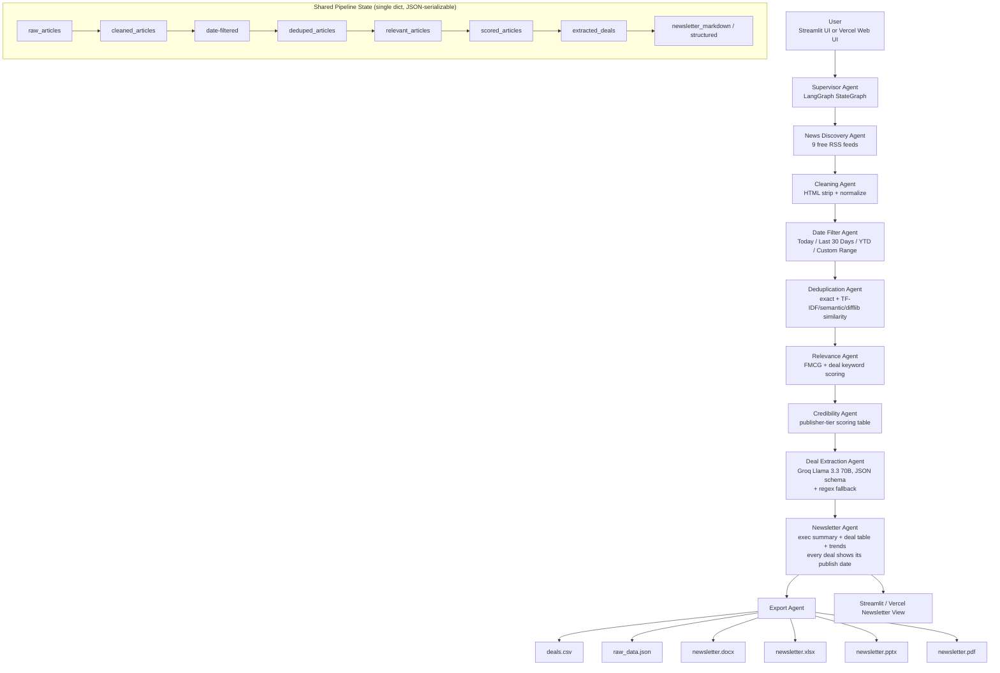

# Architecture



## Deployment topology

Two parallel front-ends share the exact same `agents/` + `exporters/` Python
core — no logic duplication:

```
                     ┌─────────────────────┐
                     │  agents/ + exporters/ │   <- shared pipeline core
                     └──────────┬───────────┘
                 ┌──────────────┴──────────────┐
                 ▼                              ▼
        streamlit_app.py                  api/index.py (FastAPI)
        (Streamlit Cloud/local)           + public/index.html
        Full exports: CSV/JSON/           (Vercel)
        DOCX/XLSX/PPTX/PDF                Lightweight exports: CSV/JSON/PDF
        requirements.txt                  requirements-vercel.txt
```

The Vercel deployment intentionally ships a smaller dependency set
(`requirements-vercel.txt` — no scikit-learn/numpy/pandas/streamlit) to
stay under Vercel's serverless function size limit. `agents/dedup_agent.py`
automatically detects this and falls back to a pure-stdlib `difflib`
similarity check with no loss of core functionality — only the near-duplicate
detection method changes (TF-IDF/semantic on Streamlit, difflib on Vercel).


## Why this shape (vs. the original 10-agent sketch)

The original brainstorm had separate `Embedding Agent`, `Retriever Agent`,
`Storage Agent` nodes wired to Pinecone + PostgreSQL. For this assignment's
actual scope (a single-run newsletter generator, not a persistent search
index), that's over-engineering that adds infra cost and failure surface
without improving the deliverable. Decisions made instead:

| Original idea | What this repo does instead | Why |
|---|---|---|
| Pinecone (separate vector DB) | Embeddings computed in-memory inside the Dedup Agent, only when needed | No paid/rate-limited external dependency; free tier limits stop mattering |
| Supabase Postgres for storage | Flat JSON/CSV export per run | This is a "generate the latest newsletter" tool, not a queryable historical archive — add Postgres later only if you need cross-run querying |
| Separate Retriever Agent | Folded into Relevance Agent (rule-based, explainable) | The assignment explicitly asks for *explainable* relevance logic — a retriever+reranker is a black box by comparison |
| Vercel deployment | **Both** supported: Streamlit Cloud (primary, full export set) + a lightweight FastAPI + static-HTML deployment on Vercel itself (`api/index.py`, `public/index.html`, `vercel.json`) | Streamlit Cloud is the easiest full-featured demo; the Vercel API variant is provided for teams that specifically need a Vercel URL, with a trimmed dependency set to fit serverless limits |
| Plain sequential script | LangGraph `StateGraph` (`agents/supervisor.py`) | Assignment explicitly asks for agent thinking, not scripts; LangGraph gives you node-level tracing, retries, and easy branching later |

## Real-time freshness

There is no separate "freshness agent" — RSS feeds are inherently live.
Every pipeline run re-fetches current feed contents, so the newsletter
always reflects the latest developments at run time. For scheduled/
"always fresh" behavior, see the GitHub Actions cron example in the README.
